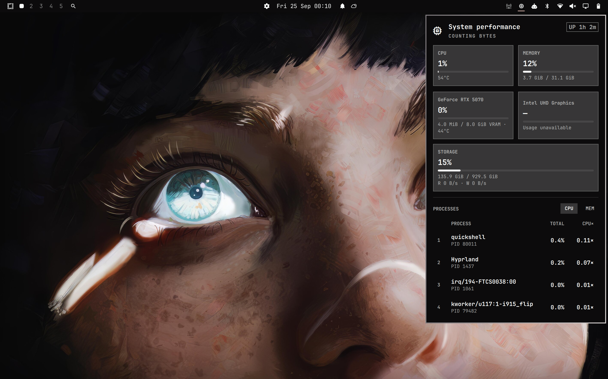

# Omarchy Performance

A native Omarchy/Quickshell bar widget for lightweight system performance monitoring.

It keeps the closed-state polling cheap, expands telemetry while the panel is open,
and uses Linux `/proc` and `/sys` interfaces directly where practical.

## Screenshot



## Features

- Global CPU usage and logical CPU count
- CPU package temperature when exposed through `hwmon`
- Used/total memory based on `MemAvailable`
- Root filesystem percentage and used/total capacity, plus block-device
  read/write activity
- NVIDIA, AMD and Intel GPU discovery, including systems with multiple GPUs
- NVIDIA utilization, VRAM and temperature through `nvidia-smi`
- AMD utilization, VRAM and temperature through the kernel's `amdgpu` interfaces
- Activity from visible DRM clients on Intel and other GPUs when the driver exposes it
- Top five processes by CPU or memory
- Process CPU shown as both total system share and logical-CPU equivalents (`CPU×`)
- Keyboard and mouse navigation
- Optional one-click launch of `btop`
- Adaptive polling: lightweight while closed, fuller sampling while open

## Requirements

- Omarchy with the Quickshell-based shell/plugin system
- Bash
- GNU awk (`gawk`)
- Standard Linux procfs/sysfs utilities (`df`, `findmnt`, `getconf`, `readlink`, `timeout`)
- Optional: `btop` and `omarchy-launch-or-focus-tui` for the action button
- Optional: `nvidia-smi` for NVIDIA telemetry
- Readable DRM `fdinfo` counters for activity from visible GPU clients

## Install

Install and enable the widget with Omarchy's plugin manager:

```sh
omarchy plugin add https://github.com/jfg96/omarchy-performance.git --enable
```

The widget is placed in the right section of the bar by default. Omarchy manages
updates and removal with `omarchy plugin update oma.performance` and
`omarchy plugin remove oma.performance`.

The plugin lives entirely in the user's Omarchy configuration and does not modify
`/usr/share/omarchy`.

## CPU semantics

Process CPU is displayed as `TOTAL | CPU×`:

- `TOTAL` is the process share of the machine's total logical CPU capacity.
- `CPU×` is the equivalent number of fully utilized logical CPUs.

For example, `1.00×` means one logical CPU fully utilized and `2.00×` means the
equivalent of two logical CPUs fully utilized.

## Sampling and reading the panel

Performance reads CPU, memory, storage and processes through `collect.sh` every
8 seconds with the panel closed and every 1.5 seconds while it is open. A
pair of independent GPU collectors starts immediately on open and then every
4 seconds. Device telemetry never waits for DRM client activity or delays the
process list. Each collector has its own 2-second timeout, with 1 second to
force a stuck subprocess to stop. Within device collection, `nvidia-smi` is
bounded to 1 second (plus 200 ms to force exit), so a stalled driver still
allows DRM device discovery. Optional `lspci` name lookups are also bounded
(200 ms plus 100 ms to force exit); a generic vendor name is used on failure. The first valid DRM sample with readable clients
schedules one warm-up sample 400 ms later, using actual elapsed time for rates.
Cards show **Calculating activity…** until that sample arrives. Activity failure
leaves device telemetry intact. Neither GPU path polls while closed; closing
cancels warm-up, and reopening after a long pause starts fresh counters.
CPU usage, process CPU and disk read/write
rates need two system samples, so they initially show zero.
Process memory is current RSS; memory and storage figures describe the most
recent sample, not an average.

Each detected GPU gets its own card: one card spans the panel, while two or more
form a two-column grid. NVIDIA and AMD report device utilization when their
driver makes it available. A card marked **Visible app activity** reports the
busiest engine measured across readable DRM clients over two samples.
It can miss work from clients this user cannot read and is not a device-wide
utilization percentage. Integrated GPUs may have no dedicated VRAM figure, and
some drivers expose no separate GPU temperature. Missing measurements show as
unavailable rather than zero.

Cards use concise display names while keeping the driver's raw names internally.
NVIDIA and AMD cards appear before Intel cards, with PCI addresses providing a
stable order within each group. Hover over a GPU name for the utilization source.
`btop` is optional: the full monitor action appears only when it and Omarchy's
TUI launcher are available.

The driver interfaces behind these readings are documented by the Linux kernel:
[AMDGPU utilization and sensors](https://docs.kernel.org/gpu/amdgpu/thermal.html),
[AMDGPU VRAM accounting](https://docs.kernel.org/gpu/amdgpu/driver-misc.html), and
[DRM client activity](https://docs.kernel.org/gpu/drm-usage-stats.html).

If system collection fails, the panel keeps the last CPU, memory and storage
values but labels them **out of date** and hides old process rows. Before any
valid system sample, it shows **Data unavailable**. GPU failures do not affect
system/process updates: old GPU readings become unavailable until a fresh GPU
sample succeeds. Readings also become out of date after several missed samples.

## Troubleshooting

- **Reading out of date / Data unavailable:** Run `./collect.sh` from
  the plugin directory. It should print a `SYSTEM` line followed by a `DISK`
  line. Check that the script is executable and that `gawk`, `findmnt` and
  `getconf` are available. The panel shows a brief collector error when it can.
- **No CPU temperature:** The CPU's `hwmon` driver may not expose a supported
  package temperature sensor. Performance leaves the value unavailable.
- **GPU shown with unavailable values:** GPU collection runs only while the
  panel is open. Check `./collect-gpu.sh` in the plugin directory. NVIDIA needs
  a working `nvidia-smi`; AMD needs readable `amdgpu` sysfs counters. Intel
  activity needs readable DRM client counters and two activity samples; run
  `./collect-gpu-activity.sh` to inspect them. A card can
  still appear when its driver does not expose one of these measurements.
- **No disk activity rate:** The root filesystem's block device may not map to
  readable `/sys/class/block/.../stat` counters. Storage capacity can still
  appear because it comes from `df`.

## Development checks

Run these from the repository root before proposing a runtime change:

```sh
bash -n collect.sh collect-gpu.sh collect-gpu-activity.sh
shellcheck collect.sh collect-gpu.sh collect-gpu-activity.sh
node tests/model.test.js
node tests/collector.test.js
node tests/gpu.test.js
node tests/gpu-lifecycle.test.js
qmllint Panel.qml
```

The model and GPU source tests use fixed samples; the collector test reads the
machine running it. CI runs the shell and Node checks on Linux. `qmllint` checks
QML syntax, but neither it nor CI verifies the widget inside a live
Omarchy/Quickshell session.

## License

MIT. See `LICENSE`.
